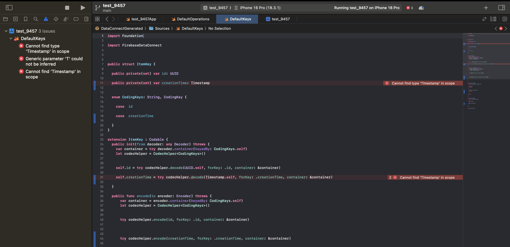

# Repro for issue 9457

## Versions

firebase-tools: 14.26.0<br>
Firebase Data Connect for VSCode: v1.10.1

## Steps to reproduce

1. Run `firebase dataconnect:sdk:generate`
2. Open the project in Xcode
3. Navigate to `test_9457/dataconnect-generated/swift/DataConnectGenerated/Sources/DefaultKeys.swift`
   - Error is raised
     

## Notes

Adding `FirebaseCore` import in `test_9457/dataconnect-generated/swift/DataConnectGenerated/Sources/DefaultKeys.swift` resolved the error

```swift
import Foundation

import FirebaseCore // <- THIS PART
import FirebaseDataConnect


public struct ItemKey {

  public private(set) var id: UUID

  public private(set) var creationTime: Timestamp


  enum CodingKeys: String, CodingKey {

    case  id

    case  creationTime

  }
}

extension ItemKey : Codable {
  public init(from decoder: any Decoder) throws {
    var container = try decoder.container(keyedBy: CodingKeys.self)
    let codecHelper = CodecHelper<CodingKeys>()


    self.id = try codecHelper.decode(UUID.self, forKey: .id, container: &container)

    self.creationTime = try codecHelper.decode(Timestamp.self, forKey: .creationTime, container: &container)

  }

  public func encode(to encoder: Encoder) throws {
      var container = encoder.container(keyedBy: CodingKeys.self)
      let codecHelper = CodecHelper<CodingKeys>()


      try codecHelper.encode(id, forKey: .id, container: &container)


      try codecHelper.encode(creationTime, forKey: .creationTime, container: &container)


    }
}

extension ItemKey : Equatable {
  public static func == (lhs: ItemKey, rhs: ItemKey) -> Bool {

    if lhs.id != rhs.id {
      return false
    }

    if lhs.creationTime != rhs.creationTime {
      return false
    }

    return true
  }
}

extension ItemKey : Hashable {
  public func hash(into hasher: inout Hasher) {

    hasher.combine(self.id)

    hasher.combine(self.creationTime)

  }
}

extension ItemKey : Sendable {}
```
### With the above code change
1. Run `firebase emulators:start --project demo-project`
2. Open the application in Xcode
3. Run the app
   - No errors raised during compilation
4. Add an item
   - Enter a name
   - Eneter a description
   - Click `Add Item`
5. Click `Get Items`
   - Query raises no errors
   - Items are displayed on screen
